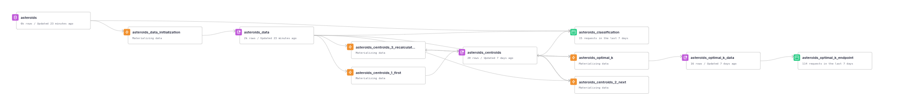
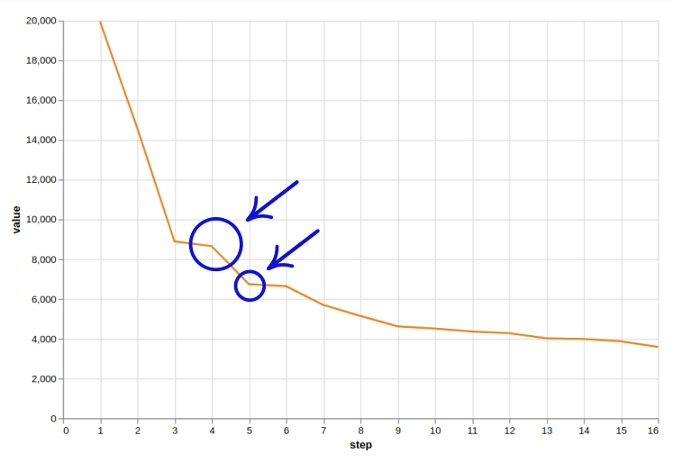
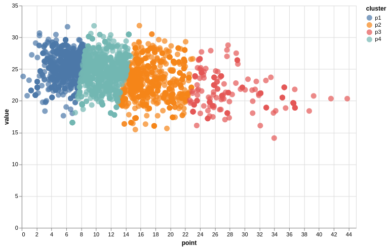

# Classifying Asteroids using K-Means Algorithm

by [Elena Torró](https://elenatorro.com)

## Introduction

This is a project developed for the ["To Infinity and beyond"](https://www.tinybird.co/events/tinybird-hackathon) Tinybird's first hackathon.
It's a proof of concept to explain how to use Tinybird for unsupervised data classification purposes, by using Asteroids information since one of the requisites of the hackathon is it has to be **space-themed**.

### What's K-Means clustering?

> K-Means clustering is an unsupervised learning algorithm. There is no labeled data for this clustering, unlike in supervised learning. K-Means performs the division of objects into clusters that share similarities and are dissimilar to the objects belonging to another cluster. The term ‘K’ is a number. You need to tell the system how many clusters you need to create. For example, K = 2 refers to two clusters. There is a way of finding out what is the best or optimum value of K for a given data. [source](https://www.simplilearn.com/tutorials/machine-learning-tutorial/k-means-clustering-algorithm#what_is_meant_by_the_kmeans_clustering_algorithm)


## Get the source data

We'll be getting asteroids data from the Near Earth Object Web Service (NeoWS) by using the [NASA public API](https://api.nasa.gov/). You need to register to get your own **API KEY**.

> Asteroids - NeoWs (Near Earth Object Web Service) is a RESTful web service for near earth Asteroid information. With NeoWs a user can: search for Asteroids based on their closest approach date to Earth, lookup a specific Asteroid with its NASA JPL small body id, as well as browse the overall data-set. All the data is from the NASA JPL Asteroid team (http://neo.jpl.nasa.gov/)

## Create a Tinybird account

Go to [Tinybird](https://www.tinybird.co/) and create a free account if don't have one already. You can create a new workspace or use an existing one.

## Project setup

* `workspace` directory:

This is the Tinybird's project. It contains the Pipes and Data Sources needed to build the analysis project.

* `scripts` directory:

> Note: the data used in this demo is already stored in `workspace/asteroids.ndjson`, so you don't need to run the python scripts to generate the data if you don't want to.

It contains a script in Python to feed the asteroids Data Source in Tinybird from the NASA's API. You'll need to set the NASA API KEY and the Tinybird's token in the script to push the data into your workspace. Take a look at `.env_tmp` to see the variables you need to get data.


## Initialize project

1. Create a virtual environment

```sh
virtualenv -p python3.8 .e
```

2. Authenticate using the Tinybird's CLI

```sh
pip install tinybird-cli
```

```sh
cd workspace
```

```sh
tb auth --token $TOKEN
```

3. Push project to workspace

```sh
tb push
```

Your workspace should have the following Data Flow:



## Push asteroids data

NeoWS API returns a maximum of 7 days of data. Each response contains an array of near objects by date with the following fields:

```json
"2022-10-14": [{
      "links": {
        "self": "http://api.nasa.gov/neo/rest/v1/neo/2216523?api_key=YOUR_API_KEY"
      },
      "id": "2216523",
      "neo_reference_id": "2216523",
      "name": "216523 (2001 HY7)",
      "nasa_jpl_url": "http://ssd.jpl.nasa.gov/sbdb.cgi?sstr=2216523",
      "absolute_magnitude_h": 20.6,
      "estimated_diameter": {
        "kilometers": {
          "estimated_diameter_min": 0.2016299194,
          "estimated_diameter_max": 0.4508582062
        },
        "meters": {
          "estimated_diameter_min": 201.6299194428,
          "estimated_diameter_max": 450.8582061718
        },
        "miles": {
          "estimated_diameter_min": 0.1252869847,
          "estimated_diameter_max": 0.2801502144
        },
        "feet": {
          "estimated_diameter_min": 661.5155049046,
          "estimated_diameter_max": 1479.1936371367
        }
      },
      "is_potentially_hazardous_asteroid": true,
      "close_approach_data": [{
        "close_approach_date": "2022-10-14",
        "close_approach_date_full": "2022-Oct-14 22:51",
        "epoch_date_close_approach": 1665787860000,
        "relative_velocity": {
          "kilometers_per_second": "16.1929934234",
          "kilometers_per_hour": "58294.7763241986",
          "miles_per_hour": "36222.1069887777"
        },
        "miss_distance": {
          "astronomical": "0.4274819404",
          "lunar": "166.2904748156",
          "kilometers": "63950387.747306948",
          "miles": "39736928.3203259624"
        },
        "orbiting_body": "Earth"
      }]
```

For our analysis we're only need to pick two quantitative variables. We've chosen `absolute_magnitude_h` and `kilometers_per_second`, but it'd be useful to run different types of analysis to see different classifications.

## Initialize origin data source


1. Append `asteroids.ndjson` file to the `asteroids` Data Source:

The data used in this demo is already saved in `workspace/asteroids.ndjson`, but you can generate it by using the script `script/get_asteroids_data.py` (remember you need an `API_KEY` for http://neo.jpl.nasa.gov/)

```sh
ASTEROIDS_API_KEY = 'YOUR_API_KEY'
ASTEROIDS_URL = 'https://api.nasa.gov/neo/rest/v1/feed'
```

```sh
python3.8 scripts/get_asteroids_data.py
mv asteroids.ndjson workspace/asteroids.ndjson
cd workspace
```

```sh
tb datasource append asteroids asteroids.ndjson
```

Filter data to `asteroids_data` Data Source to use only the data we need through the `asteroids_data_initialization` pipe:

> Note: `--force` flag is to force overrididing the pipe since it already exists

```sh
tb push asteroids_data_initialization.pipe --populate --force
```

## Find optimal K

Number `K` is the number of clusters we'll use to classify the data. We'll use well-known **Elbow method** to calculate the optimal value for `K`. 

> Note: Initial steps to initialize the centroids are the same to finally apply k-means, so we will repeat them later.

This is the flow:

1. Calculate next centroid
2. Calculate value

The first centroid will be calculated with `asteroids_centroids_1_first`. Next ones, with `asteroids_centroids_2_next`. Resulting values will be stored in the `asteroids_centroids` Data Sources.

The steps are calculated with `asteroids_optimal_k`, and resulting values will be stored in the `asteroids_optimal_k_data` Data Source.

### First step:

1. Populate first centroid:

```sh
tb push asteroids_centroids_1_first.pipe --populate --force
```

2. Calculate first step:

```sh
tb push asteroids_optimal_k.pipe --populate  --force
```

### Next steps:

1. Calculate next centroid

```sh
tb push asteroids_centroids_2_next.pipe --populate --force
```

2. Recalculate next step:

```sh
tb push asteroids_optimal_k.pipe --populate  --force
```

3. Repeat

You have to do this as many times you consider enough until you can visualize optimal K value:

```sh
repeat 15 { tb push asteroids_centroids_2_next.pipe --populate --force; tb push asteroids_optimal_k.pipe --populate --force }
```

4. Publish classification endpoint

To see how the graph evolves, you can use `asteroids_optimal_k_endpoint` to visualize the graph in [Vega](https://vega.github.io/editor/#/):

```sh
tb push asteroids_optimal_k_endpoint.pipe
```

Replace `YOUR_API_URL` with your API endpoint and paste the following code in [Vega](https://vega.github.io/editor/#/). It should be something like: https://api.tinybird.co/v0/pipes/asteroids_optimal_k_endpoint.csv?token=YOUR_READ_TOKEN

```json
{
    "$schema": "https://vega.github.io/schema/vega-lite/v3.json",
    "width": 600,
    "height": 400,
    "data": {
        "url": "YOUR_API_URL",
        "format": {
            "type": "csv"
        }
    },
    "mark": {
        "type": "line"
    },
    "encoding": {
        "x": {
            "field": "step",
            "title": "step",
            "type": "quantitative"
        },
        "y": {
            "title": "value",
            "field": "value",
            "type": "quantitative"
        },
        "color": {
            "value": "#E58606"
        }
    }
}
```

In our case, we're goin to choose **4** as our optimal `K` value, although we could also use **5**.



## Calculate K clusters

Now that we know the value for K, let's start again:

1. Truncate centroids Data Source:

```sh
 tb datasource truncate asteroids_centroids --yes
```

1. Populate first centroid

```sh
tb push asteroids_centroids_1_first.pipe --populate --force
```

2. Populate next centroids as many times as clusters you need (K - 1 times, since we've already calculated the first centroid)

```sh
repeat 3 { tb push asteroids_centroids_2_next.pipe --populate --force }
```

3. Now, populate recalculate centroids as many times as clusters you need (K times)

```sh
repeat 4 { tb push asteroids_centroids_3_recalculate.pipe --populate --force }
```

Extra: check how centroids evolve using the `asteroids_centroids_endpoint` endpoint:

```json
{
  "$schema": "https://vega.github.io/schema/vega-lite/v3.json",
  "width": 600,
  "height": 400,
  "layer": [{
    "data": {
      "url": "asteroids_centroids_endpoint",
      "format": {
        "type": "csv"
      }
    },
    "mark": {
      "type": "point",
      "color": "black",
      "filled": true
    },
    "encoding": {
      "x": {
        "field": "x",
        "type": "quantitative"
      },
      "y": {
        "field": "y",
        "type": "quantitative"
      },
      "size": {
        "value": 100
      }
    }
  }]
}
```

4. Publish classification endpoint

```sh
tb push asteroids_classification.pipe
```

5. Visualize the clusters:



Replace `YOUR_API_URL` with your API endpoint and paste the following code in [Vega](https://vega.github.io/editor/#/). It should be something like: https://api.tinybird.co/v0/pipes/asteroids_classification.csv?token=YOUR_READ_TOKEN

```json
{
    "$schema": "https://vega.github.io/schema/vega-lite/v3.json",
    "width": 600,
    "height": 400,
    "data": {
        "url": "YOUR_API_URL",
        "format": {
            "type": "csv"
        }
    },
    "mark": {
        "type": "point",
        "interpolate": "monotone",
        "filled": true
    },
    "encoding": {
        "x": {"field": "point", "type": "quantitative"},
        "y": {"field": "value", "type": "quantitative"},
        "color" : {"field": "cluster", "type" : "nominal"},
        "size" : {"value": 100},
        "tooltip": [{
            "field": "asteroid_id",
            "type": "nominal"
        },{
            "field": "kilometers_per_second",
            "type": "quantitative"
        },{
            "field": "absolute_magnitude_h",
            "type": "quantitative"
        }]
    }
}
```

Extra: show centroids also

```json
{
  "$schema": "https://vega.github.io/schema/vega-lite/v3.json",
  "width": 600,
  "height": 400,
  "layer": [{
    "data": {
      "url": "asteroids_centroids_endpoint",
      "format": {
        "type": "csv"
      }
    },
    "mark": {
      "type": "point",
      "interpolate": "monotone",
      "filled": true
    },
    "encoding": {
      "x": {
        "field": "point",
        "type": "quantitative"
      },
      "y": {
        "field": "value",
        "type": "quantitative"
      },
      "color": {
        "field": "cluster",
        "type": "nominal"
      },
      "size": {
        "value": 100
      },
      "tooltip": [{
        "field": "asteroid_id",
        "type": "nominal"
      }, {
        "field": "kilometers_per_second",
        "type": "quantitative"
      }, {
        "field": "absolute_magnitude_h",
        "type": "quantitative"
      }]
    }
  }, {
    "data": {
      "url": "YOUR_API_URL",
      "format": {
        "type": "csv"
      }
    },
    "mark": {
      "type": "point",
      "color": "black",
      "filled": true
    },
    "encoding": {
      "x": {
        "field": "x",
        "type": "quantitative"
      },
      "y": {
        "field": "y",
        "type": "quantitative"
      },
      "size": {
        "value": 100
      }
    }
  }]
}
```

## Sources

* [NASA Public API](https://api.nasa.gov/)
* [K-Means implementation in ClickHouse](https://prog.world/k-means-in-clickhouse/)
  * [clickhouse-k-means GitHub Repo](https://github.com/bvt123/clickhouse-k-means)
* [How to Determine the Optimal K for K-Means?](https://medium.com/analytics-vidhya/how-to-determine-the-optimal-k-for-k-means-708505d204eb), by 
Khyati Mahendru